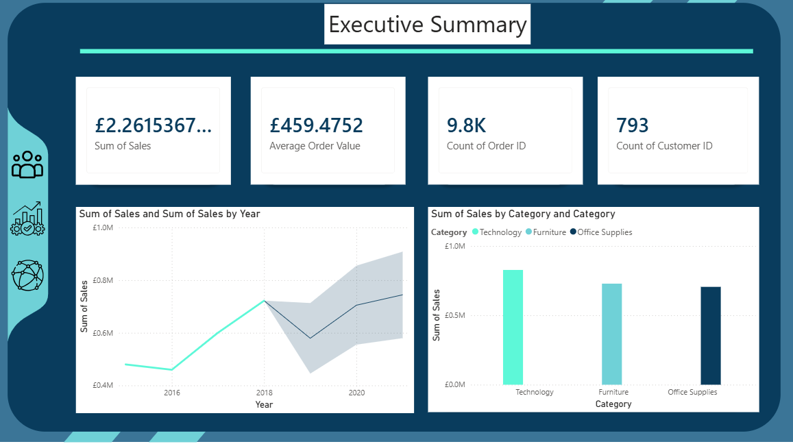
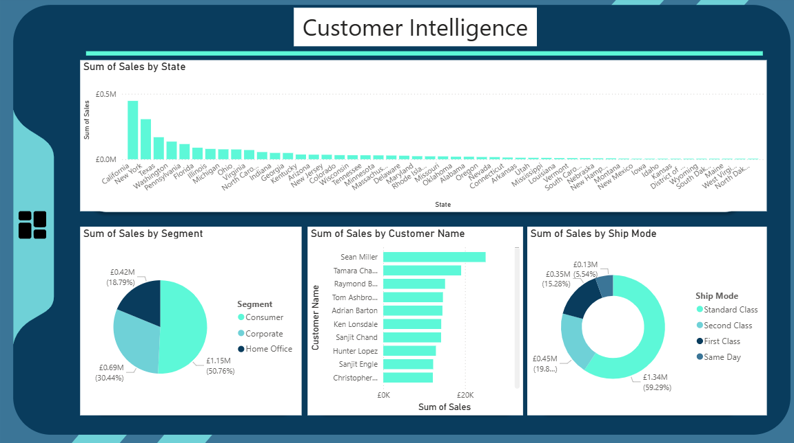
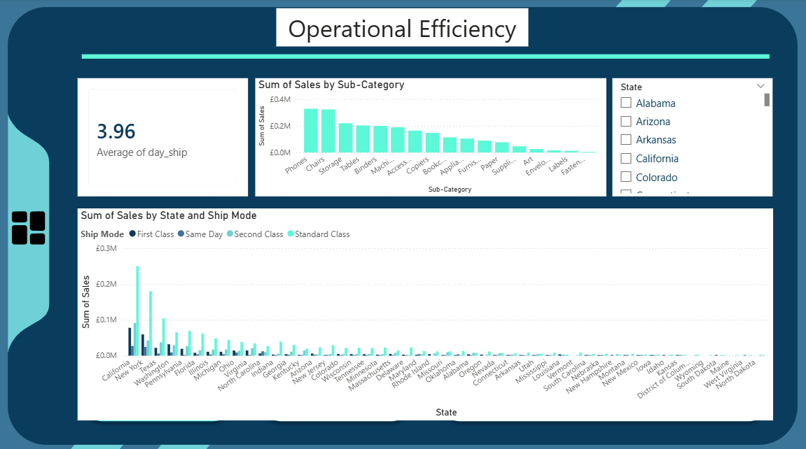
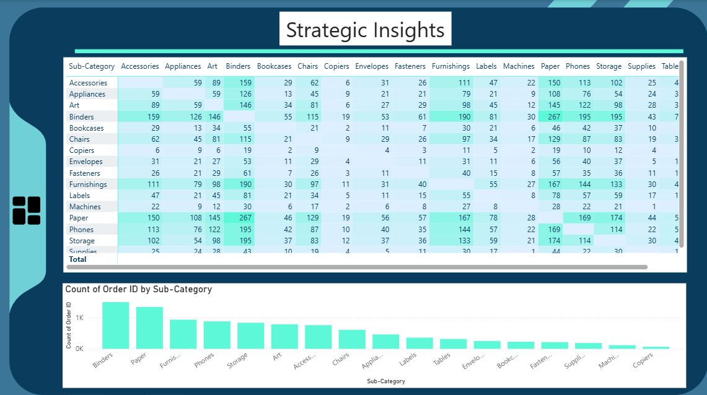

# 🛒 Global Retail Sales & Customer Intelligence Dashboard

## 📌 Executive Summary
An end-to-end Power BI business intelligence dashboard analyzing retail performance across **£2.26M+ in sales** and **9.8K orders**. The project provides cross-functional visibility into revenue pacing, customer demographic segmentation, fulfillment operations, and **Market Basket product association** to drive cross-selling strategies.

---

## 📊 Dashboard Modules

### 1. Executive Summary

* **Core KPIs:** Total Revenue (£2.26M), Average Order Value (£459.48), Total Orders (9.8K), and Customer Base (793 customers).
* **Key Visuals:** Historical sales pacing with predictive forecasting alongside category revenue contribution led by **Technology** and **Furniture**.

---

### 2. Customer Intelligence & Segmentation

* **Segment Share:** Consumer segment dominates revenue at **50.76%** (£1.15M), followed by Corporate (30.44%) and Home Office (18.79%).
* **Geographic Penetration:** California and New York lead overall state sales.
* **Fulfillment Preferences:** Standard Class shipping accounts for **59.29%** (£1.34M) of order volume.

---

### 3. Operational & Logistics Efficiency

* **Fulfillment Velocity:** Average shipping cycle stands at **3.96 days**.
* **Sub-Category Sales:** Phones, Chairs, and Storage represent the highest revenue-generating product lines.
* **Fulfillment Distribution:** Evaluated state-level logistics methods (First Class, Same Day, Second Class, Standard Class).

---

### 4. Strategic Insights & Basket Analysis

* **Market Basket Matrix:** Analyzed product co-occurrence frequencies across order transactions (e.g., Binders frequently co-purchased with Paper and Furnishings).
* **Order Frequency:** Identified top volume drivers by Sub-Category transaction counts.

---

## 🛠️ Tech Stack & DAX Methods
* **BI Tool:** Microsoft Power BI
* **Data Modeling:** Star Schema Design & Cross-Table Relationships
* **Analytics Techniques:** Market Basket Analysis, Time-Series Forecasting, Slicers & Dynamic Tooltips
